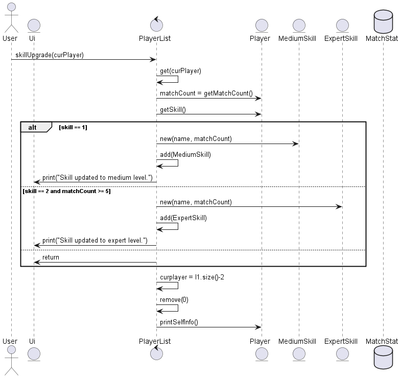

# Developer Guide

## Acknowledgements

{list here sources of all reused/adapted ideas, code, documentation, and third-party libraries -- include links to the original source as well}

## Class Structure

### Player Class

- **Attributes:**
    - `name`: String - The player's name.
    - `matchCount`: int - The number of matches played.
    - `power`: int - The player's power level.
    - `skill`: int - The player's skill level.

- **Methods:**
    - `printSelfInfo()`: void - Displays the player's basic information.
    - `printGoalBeforeShoot()`: void - Abstract method to display goal during a penalty shoot.
    - `getSkill()`: int - Returns the player's skill level.
       
### Skill Level Subclasses (BeginnerSkill, MediumSkill, ExpertSkill)

These subclasses extend Player, each representing different skill levels and overriding methods to provide specific functionalities.

### PlayerList Class

- **Attributes:**
    - `l1`: ArrayList<Player> - A list of player objects.

- **Methods:**
    - `skillUpgrade(int curPlayer)`: void - Upgrades the skill level of the player at the specified index.

## Design & implementation

The implementation of the player management system in the NUSFC24 is designed with extensibility and flexibility in mind. This section delves into the design rationale, how the system accommodates new and returning players, and how skill upgrades are managed.

### Player Management

The system is built around the Player class and its subclasses (BeginnerSkill, MediumSkill, ExpertSkill), with a `PlayerList` class managing all player instances. This design allows for a scalable way to add new player types and manage their interactions within the game:

- **Player Class**: Serves as the base class for all players, encapsulating common attributes such as `name`, `matchCount`, `power`, and `skill`, and common behaviors.
- **Skill Level Subclasses**: These subclasses inherit from Player and override specific methods to reflect their skill level's unique behaviors and characteristics.
- **PlayerList Class**: Manages a collection of Player instances, facilitating operations like adding new players and upgrading their skills through the `skillUpgrade` method.

### Handling New and Returning Players

Upon a user entering the game, the system determines whether to fetch an existing player from PlayerList or to create a new player instance. This process is crucial for providing a seamless user experience, whether they are returning players or first-time participants.

- **New Players**: For users new to the game, a Player object is created with the BeginnerSkill level by default. This player is then added to the PlayerList, ready for game participation.
- **Returning Players**: For users returning to the game, their Player object is retrieved from the PlayerList using identifying information (e.g., player name). This allows the game to maintain continuity in the player's progression.

### Skill Upgrade Mechanism

The `skillUpgrade` method in the `PlayerList` class is a key feature, allowing players to improve their skills based on game performance. The method checks the player's current skill and match count, upgrading their skill level if certain conditions are met.
he mechanism operates through a structured process, enhancing the gaming experience by offering a realistic approach to skill progression:

1. **Skill Level Assessment**: The system evaluates a player's current skill level alongside their performance metrics, such as match count and success rate.

2. **Determination of Skill Upgrade Eligibility**: Utilizing predefined criteria, the system determines if a player qualifies for a skill upgrade. These criteria may include metrics like a minimum number of matches played or specific performance thresholds.

3. **Application of Skill Upgrade**: Eligible players will have their skill attribute adjusted to a higher level. This upgrade might unlock new abilities, enhance stats, or offer other in-game advantages.

4. **Feedback to the User**: The system informs the user of the successful skill upgrade through UI messages or other feedback mechanisms, providing immediate recognition of their achievement.

## Product scope
### Target user profile

{Describe the target user profile}

### Value proposition

{Describe the value proposition: what problem does it solve?}

## User Stories

|Version| As a ... | I want to ... | So that I can ...|
|--------|----------|---------------|------------------|
|v1.0|new user|see usage instructions|refer to them when I forget how to use the application|
|v2.0|user|find a to-do item by name|locate a to-do without having to go through the entire list|

## Non-Functional Requirements

{Give non-functional requirements}

## Glossary

* *glossary item* - Definition

## Instructions for manual testing

{Give instructions on how to do a manual product testing e.g., how to load sample data to be used for testing}
